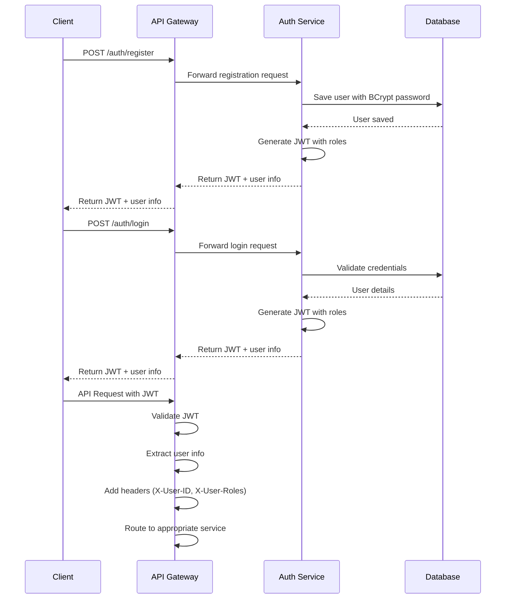
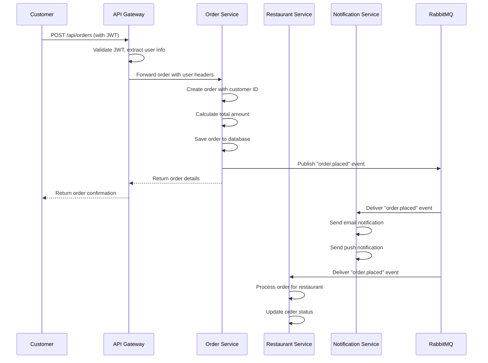

# 🏗️ ByteBites Platform Architecture

## 📋 System Overview

ByteBites is a microservices-based food delivery platform that connects customers with local restaurants. The system is built using Spring Boot microservices with event-driven architecture and resilience patterns.

## 🏛️ Architecture Diagram

```
┌─────────────────────────────────────────────────────────────────────────────────┐
│                              CLIENT APPLICATIONS                                │
│  ┌─────────────┐  ┌─────────────┐  ┌─────────────┐  ┌─────────────┐           │
│  │   Web App   │  │ Mobile App  │  │  Admin App  │  │  Postman    │           │
│  └─────────────┘  └─────────────┘  └─────────────┘  └─────────────┘           │
└─────────────────────────────────────────────────────────────────────────────────┘
                                    │
                                    ▼
┌─────────────────────────────────────────────────────────────────────────────────┐
│                              API GATEWAY (8080)                                 │
│  ┌─────────────────────────────────────────────────────────────────────────────┐ │
│  │  • JWT Authentication Filter                                               │ │
│  │  • Request Routing                                                         │ │
│  │  • CORS Handling                                                           │ │
│  │  • Load Balancing                                                          │ │
│  └─────────────────────────────────────────────────────────────────────────────┘ │
└─────────────────────────────────────────────────────────────────────────────────┘
                                    │
                    ┌───────────────┼───────────────┐
                    ▼               ▼               ▼
┌─────────────────┐ ┌─────────────────┐ ┌─────────────────┐ ┌─────────────────┐
│ DISCOVERY       │ │ CONFIG SERVER   │ │ AUTH SERVICE    │ │ RESTAURANT      │
│ SERVER (8761)   │ │ (8888)          │ │ (8081)          │ │ SERVICE (8082)  │
│                 │ │                 │ │                 │ │                 │
│ • Eureka        │ │ • Git Config    │ │ • User Auth     │ │ • Restaurant    │
│ • Service Reg   │ │ • Properties    │ │ • JWT Issuance  │ │   Management    │
│ • Health Check  │ │ • Profiles      │ │ • Role Mgmt     │ │ • Menu Items    │
└─────────────────┘ └─────────────────┘ └─────────────────┘ └─────────────────┘
                                                                    │
                                                                    ▼
┌─────────────────┐ ┌─────────────────┐ ┌─────────────────┐ ┌─────────────────┐
│ ORDER SERVICE   │ │ NOTIFICATION    │ │ RABBITMQ        │ │ POSTGRESQL      │
│ (8083)          │ │ SERVICE (8084)  │ │ (5672/15672)    │ │ (5432)          │
│                 │ │                 │ │                 │ │                 │
│ • Order Mgmt    │ │ • Email Notif   │ │ • Message Queue │ │ • User Data     │
│ • Status Track  │ │ • Push Notif    │ │ • Event Bus     │ │ • Restaurant    │
│ • Circuit Brkr  │ │ • Event Handler │ │ • Pub/Sub       │ │   Data          │
└─────────────────┘ └─────────────────┘ └─────────────────┘ │ • Order Data    │
                                                            └─────────────────┘
```

## 🔄 Authentication Flow Sequence



## 🛒 Order Processing Flow



## 🔐 Security Architecture

### JWT Token Structure
```json
{
  "header": {
    "alg": "HS256",
    "typ": "JWT"
  },
  "payload": {
    "sub": "123",
    "email": "customer@example.com",
    "roles": "ROLE_CUSTOMER",
    "iat": 1640995200,
    "exp": 1641081600
  },
  "signature": "HMACSHA256(base64UrlEncode(header) + '.' + base64UrlEncode(payload), secret)"
}
```

### Role-Based Access Control (RBAC)

| Role | Permissions | Endpoints |
|------|-------------|-----------|
| `ROLE_CUSTOMER` | Place orders, view own orders, browse restaurants | `POST /api/orders`, `GET /api/orders`, `GET /api/restaurants` |
| `ROLE_RESTAURANT_OWNER` | Manage own restaurant, view restaurant orders | `POST /api/restaurants`, `PUT /api/restaurants/{id}`, `GET /api/orders/restaurant/{id}` |
| `ROLE_ADMIN` | Full system access, user management | `GET /admin/users`, `GET /admin/orders` |

## 🔄 Event-Driven Architecture

### Message Flow
1. **Order Placed Event**
   - Publisher: Order Service
   - Queue: `order.placed`
   - Subscribers: Notification Service, Restaurant Service

2. **Event Payload**
   ```json
   {
     "orderId": 123,
     "customerId": 456,
     "restaurantId": 789,
     "totalAmount": 29.99,
     "timestamp": "2024-01-01T12:00:00Z"
   }
   ```

## 🛡️ Resilience Patterns

### Circuit Breaker Configuration
```yaml
resilience4j:
  circuitbreaker:
    instances:
      orderService:
        sliding-window-size: 10
        failure-rate-threshold: 50
        wait-duration-in-open-state: 10000
        permitted-number-of-calls-in-half-open-state: 3
```

### States
- **CLOSED**: Normal operation
- **OPEN**: Service unavailable, fallback triggered
- **HALF_OPEN**: Testing if service recovered

## 📊 Service Communication

### Synchronous Communication
- REST APIs via API Gateway
- Service-to-service calls with circuit breakers
- Load balancing via Eureka

### Asynchronous Communication
- RabbitMQ for event publishing
- Event-driven processing
- Decoupled service communication

## 🔧 Configuration Management

### Spring Cloud Config
- Centralized configuration
- Git-backed configuration repository
- Environment-specific profiles
- Dynamic configuration updates

### Configuration Hierarchy
```
application.yml (default)
├── application-dev.yml
├── application-prod.yml
└── service-specific.yml
```

## 📈 Monitoring & Observability

### Actuator Endpoints
- `/actuator/health` - Service health
- `/actuator/info` - Service information
- `/actuator/metrics` - Performance metrics
- `/actuator/circuitbreakerevents` - Circuit breaker status

### Service Discovery
- Eureka dashboard: http://localhost:8761
- Service registration and health checks
- Load balancing configuration

## 🚀 Deployment Architecture

### Development Environment
```
┌─────────────────────────────────────────────────────────────────┐
│                    Docker Compose Stack                         │
│  ┌─────────────┐  ┌─────────────┐  ┌─────────────┐            │
│  │  RabbitMQ   │  │ PostgreSQL  │  │   Redis     │            │
│  │   (5672)    │  │   (5432)    │  │   (6379)    │            │
│  └─────────────┘  └─────────────┘  └─────────────┘            │
└─────────────────────────────────────────────────────────────────┘
```

### Production Considerations
- Kubernetes deployment
- Horizontal pod autoscaling
- Database clustering
- Message queue clustering
- Load balancer configuration
- SSL/TLS termination
- Monitoring and logging stack

## 🔄 Data Flow Patterns

### Request Flow
1. Client sends request to API Gateway
2. Gateway validates JWT and extracts user info
3. Gateway routes request to appropriate service
4. Service processes request with user context
5. Service returns response through gateway
6. Gateway returns response to client

### Event Flow
1. Service publishes event to RabbitMQ
2. RabbitMQ delivers event to subscribers
3. Subscriber services process events asynchronously
4. Events trigger business logic updates

## 🎯 Key Design Principles

1. **Single Responsibility**: Each service has a focused domain
2. **Loose Coupling**: Services communicate via events
3. **High Cohesion**: Related functionality grouped together
4. **Fault Tolerance**: Circuit breakers and fallbacks
5. **Scalability**: Horizontal scaling capability
6. **Security**: JWT-based authentication and RBAC
7. **Observability**: Comprehensive monitoring and logging 